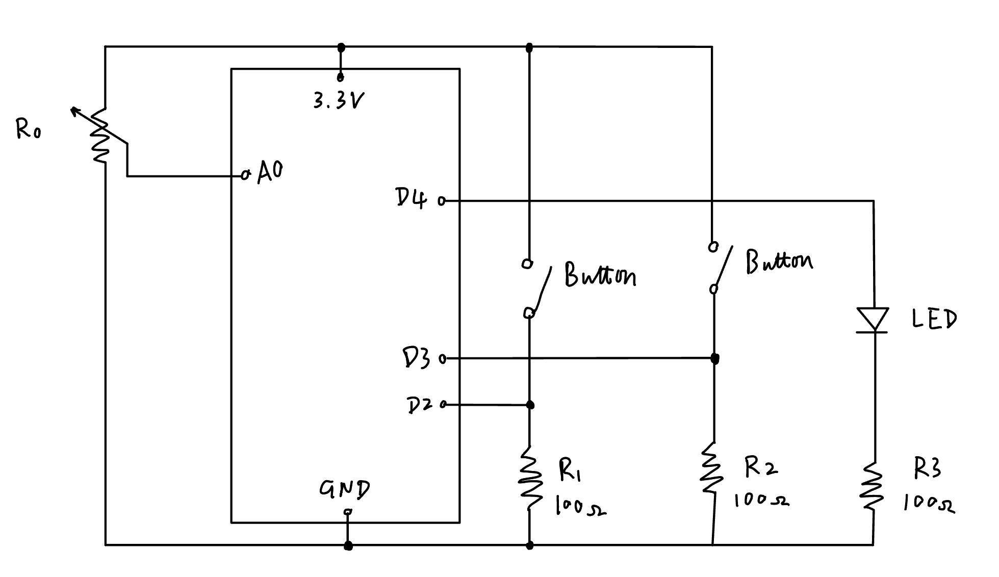

# HW12
 
This homework is about serial communication between Arduino and p5.js. It is also part of the [final project](https://github.com/6063-fuguoxue/Final) for the Creative Coding class. 

## Circuit Diagram



## Code Explanation

### Serial Communication

In this project, I designed the two-way communication between Arduino and p5.js. p5.js will detect if a face exists within the camera range, which will control an LED connected to the Arduino board. On the other hand, the potentiometer and the two buttons connected to the Arduino board should be able to control digital elements on the p5.js side. 

I started by sending information from Arduino to p5.js. Due to limited time this week, I only implemented the logic for the potentiometer. By rotating the potentiometer, one can change the value of the slider bar on the screen. Similarly, the information triggered by button presses can also be used to change p5.js content. 

The p5.js-to-Arduino communication took me a bit longer to figure out. In `function drawOthers()`, I wrote the following: 

```
if (mSerial.opened() && readyToReceive) {
    readyToReceive = false;
    mSerial.clear();
    
    
    if (detections.length && prevDetectionsLeng == 0) {     
      mSerial.write(1);
      mSerial.write(0xab);
    } else if (detections.length == 0 && prevDetectionsLeng) {
      mSerial.write(0);
      mSerial.write(0xab);
    } else {      
      mSerial.write(0xab);
      console.log(0xab);
    }
    prevDetectionsLeng = detections.length;
    
  }
```

The logic is: if the camera detects face(s) and no face is detected right before, p5.js sends `1` to Arduino. Else if the camera detects no face and face(s) is detected right before, p5.js sends`0` to Arduino. Else, send `0xab`, which will be interpreted by Arduino as a request for messages. The `1` and `0` will be interpreted by Arduino to turn on or off the LED light. 

Previous to the working version above, I wrote the code block below that stops communication upon changes in face detection: 

```
if (mSerial.opened() && readyToReceive) {
    readyToReceive = false;
    mSerial.clear();
    
    
    if (detections.length && prevDetectionsLeng == 0) {     
      mSerial.write(1);
      // mSerial.write(0xab); // I didn't write this
    } else if (detections.length == 0 && prevDetectionsLeng) {
      mSerial.write(0);
      // mSerial.write(0xab); // I didn't write this
    } else {      
      mSerial.write(0xab);
      console.log(0xab);
    }
    prevDetectionsLeng = detections.length;
    
  }
```
I wonder why this is because the `function drawOthers()` is called by the `function gotResults(err, result)`, which runs iteratively. Also, when printing the number of faces in the `function gotResults(err, result)`, the number changes timely to the appearing and disappearing of faces. 

### Facial Landmarks

I want to draw the facial landmarks because I think it may be useful for visuals production later. I searched online and found [this](https://editor.p5js.org/rios/sketches/QH1ch5GFr) example. Interestingly, this example has no `function draw()`. Upon code reading, I found that the `function gotResults(err, result)` is basically calling itself so functions similar to a `function draw()`. Therefore, I moved what used to be in `function draw()` to `function drawOther()`, and let `function gotResults(err, result)` call `function drawOther()` before each iteration. 

## Video

<div align="center" style="width:50%;">
      <a href="https://www.youtube.com/shorts/geEiispm_2I">
         
      </a>
</div>
